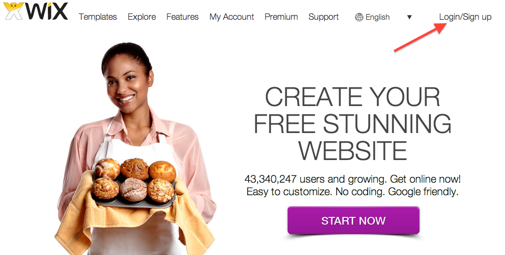
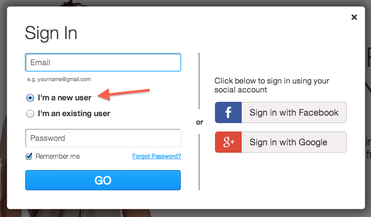
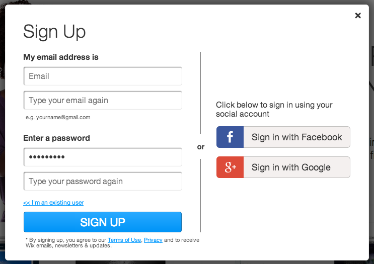
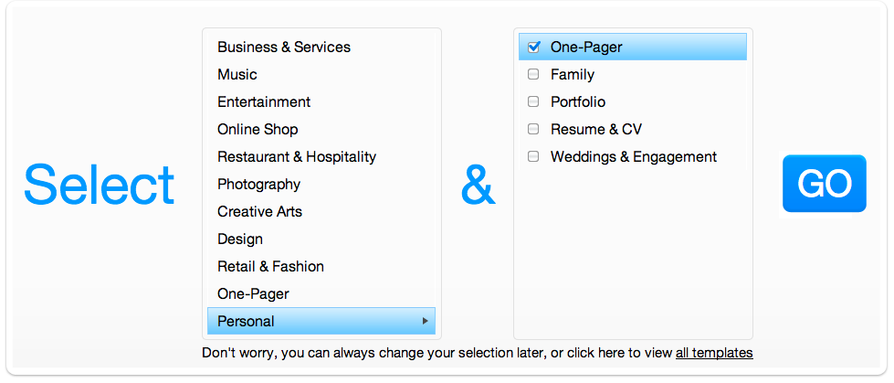
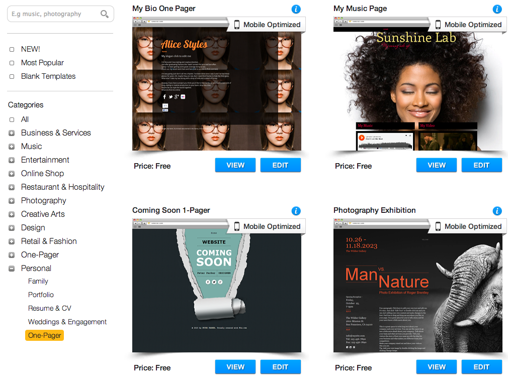
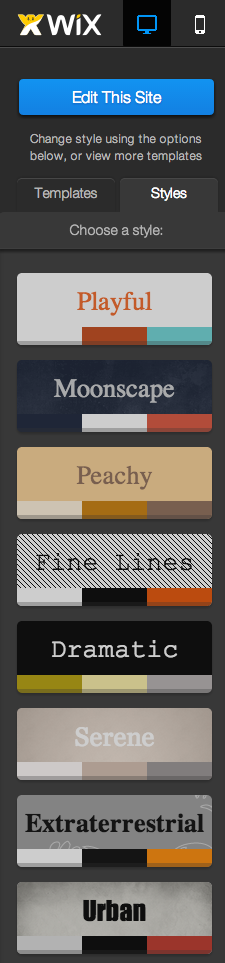

## What is Wix?

- Wix is a free website builder
- Drag-and-drop text, pictures, and other elements onto a webpage 
- Publish your webpage with a personal web address
- Wix provides an easy interface to learn about and interact with the components of a website

---

## Signing Up for Wix

- You only need an email addrss to sign up
- Go to www.wix.com to create your account

---

## Creating an account

- Enter your email address and set your password
- Make sure you indicate you're a new user!

---

## Creating an account

- You will be prompted to type in you email address and password twice to check for accuracy.

---

## Select website layout

- We recommend a personal one-pager site, but you can always add pages later!

---

## Select website theme

- Pick any theme you that you like!

---

## Pick your website's color style

- Browse a variety of color styles for your site:
- Choose whatever you think looks good!

