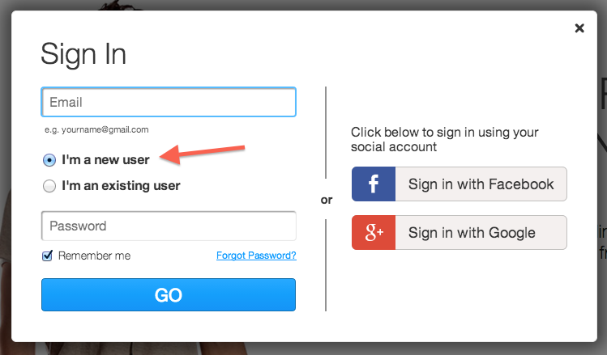
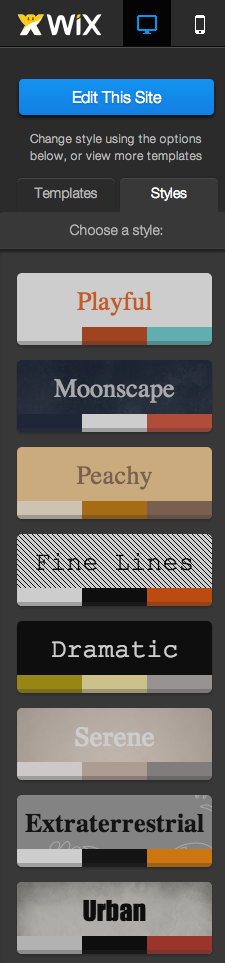

## What is Wix?

- Wix is a free website builder
- Drag-and-drop text, pictures, and other elements onto a webpage 
- Publish your webpage with a personal web address
- Wix provides an easy interface to learn about and interact with the components of a website

---

## Signing Up for Wix

- You only need an email address to sign up
- Go to www.wix.com to create your account

---

## Creating an account

- Enter your email address and set your password
- Make sure you indicate you're a new user!

---

## Creating an account

- You will be prompted to type in you email address and password twice to check for accuracy.

---

## Select website layout

- We recommend a personal one-pager site, but you can always add pages later!

---

## Select website theme

- Pick any theme you that you like!

---

## Pick your website's color style

- Browse a variety of color styles for your site:
- Choose whatever you think looks good!

---

## Customize your page with the sidebar

- The pages sidebar allows you to add more pages to your site.
- You can create links to different pages of your site using this sidebar.

---

## Customize your page with the sidebar

- The design sidebar allows you to customize everything about your site's content.

---

## Customize your page with the sidebar

- With the add sidebar you can drag-and-drop elements onto your webpage and then edit their contents right on the page!
- However you arrange and edit these elements is how they will appear on your site.

---

## Publish your site

- Once you've got the site looking exactly as you would like it too, click in the "Publish" button in the upper-right corner of the page.
- Don't worry - if you want to change some part of your webpage later you can always come back and make edits.

---

## Publish your site

- Think of a great name for your site, type it in and click "save now."

---

## Publish your site

- Your work has been saved, but you'll need to click "publish your site online" in order to get your site out on the whole world wide web.

---

## Publish your site

- You can use the default SEO settings or change them here if you wish, when you're finished click "okay".

---

## Publish your site

- Finally your site is out there on the web!
- Click on your highlighted, personalized URL to navigate to your new website!

---

## Welcome to your brand new site!

- Your site has been published and can now be accessed all over the world on the internet! Congratulations!

---

## Preview your site on mobile

- In the upper left-hand corner you can select mobile view.
- Mobile view will simulate what your site looks like on a phone's web browser.

---

## Edit your mobile site

- Any changes made to your mobile site automatically show up on the desktop version of your site.

